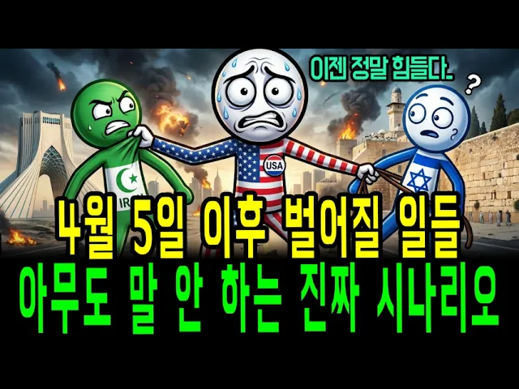

# 4월 경제 위기, 기름값, 환율, 금값, 반도체까지? 당신의 돈을 지킬 투자 전략!!전 세계 큰손들이 4월 5일을 두려워하는 진짜 이유!!

## 기본 정보
- **URL**: https://www.youtube.com/watch?v=TEXorHMZTWg
- **채널명**: 방구석 워런버핏
- **구독자수**: 3만
- **조회수**: 147,461
- **업로드일**: 2026-03-29
- **영상 길이**: 23:28
- **댓글 수**: 248
- **좋아요 수**: 4,845

## 썸네일

---

## 댓글 (추천순 TOP 10)

| 순위 | 좋아요 | 댓글 |
|------|--------|------|
| 1 | 57 | 물가보면 우리가 전쟁하는줄 다 알겟어 |
| 2 | 3 | 뭐라세요 😎 😎  반정부 세력야? 이재명이 잘하고 있구만 |
| 3 | 1 | ​@Qjumper0815ㅋㅋㅋ 배급견으로 살아가고 싶으신가보죠😂 |
| 4 | 4 | ​@Qjumper0815돌아이 여깄네 지하철 막고 피켓이나 들어 |
| 5 | 3 | ​@Qjumper0815 싸고있네 |
| 6 | 2 | ​@Qjumper0815어쩌라구 돌아이네 ㅋ |
| 7 | 38 | 신문.방송.보다 훨씬 좋습니다.. 응원합니다.. |
| 8 | 36 | 전쟁나면 금값 상승? 아닐걸요. 지난 수십년 통계상. 전쟁직전까지 오르고 전쟁중엔 떨어지고 종료후 반등했죠 |
| 9 | 65 | 이란 국민들. 독재를 몰아내고 자유를 찾을 기회가 왔는데도 봉기를 하지않으면 다시는 자유를 찾을 기회가 안 온다. 자유는 그냥 주어지는 것이 아니다. 피 흘리며 쟁취를 해야한다. |
| 10 | 4 | 종교에 세뇌되어서 힘듬 ㅋ |
