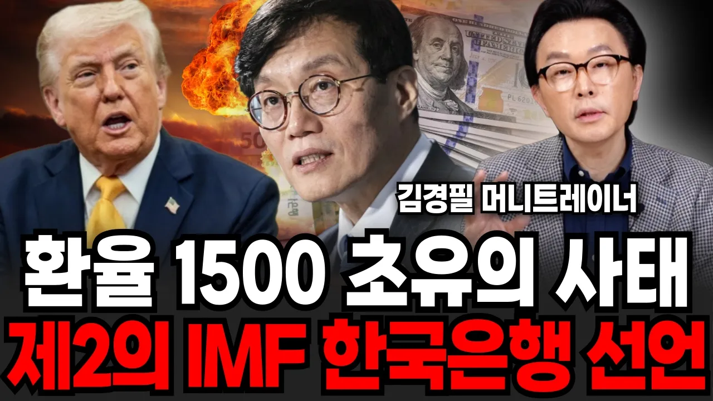

# 환율 1500 초유의 사태, 제2의 IMF 한국은행 선언? (김경필 머니트레이너 / 3부)

## 기본 정보
- **URL**: https://www.youtube.com/watch?v=Fy04APNfC6Y
- **채널명**: 신사임당
- **구독자수**: 271만
- **조회수**: 51,018
- **업로드일**: 2026-03-29
- **영상 길이**: 15:38
- **댓글 수**: 87
- **좋아요 수**: 749

## 썸네일

---

## 댓글 (추천순 TOP 10)

| 순위 | 좋아요 | 댓글 |
|------|--------|------|
| 1 | 7 | https://m.site.naver.com/23S4L
 👆🏻자본금 500만 원 이하로, 하루 30분 일하고 월급버는 공간사업이 궁금하다면? 
 
 🎁지금 신청하면 받을 수 있는 시크릿혜택
 ☑ 종류별 나에게 딱맞는 공간사업 정리자료 (공간대여업 올인원)
 ☑ 돈이 되는 지역 검색 키워드 자료
 ☑ 에어비앤비 자동화 매뉴얼 
 
 ✅ 돈이 없어도, 나이가 많아도 누구든 할 수 있습니다
 
 🔥선착순 신청 마감되니, 절대 이번 무료강의를 놓치지 마세요🔥 |
| 2 | 26 | 이미 막는건 불가능 각자도생의 시작 잘 준비하시길.. |
| 3 | 11 | 외환보유액 3월꺼 외국인들이 달러바꾼거 대충 계산만해도 4200억에서 3xxx억 대로 내려왔는데. 이거 또 어떻게 포장할지... |
| 4 | 8 | 다들 빚부터 빨리 갚아요 늘리지도 말고 |
| 5 | 7 | 금리랑 정책이 엮여서 영향을 끼치는 것 같은데 정책 때문이 아니라고 단정은 못 짓겠네요 |
| 6 | 13 | 앞으로 현금없는 사람들은 지옥일것이다 |
| 7 | 59 | 예견된거 아니였나 돈을 그렇게 풀어대는데 당연한 결과지 |
| 8 | 4 | 돈은 풀고, 금리올려서 청소해야  하는 빚들을 꾹꾹 눌러서 지금까지 온거죠. |
| 9 | 0 | ㅉ는 합니다 나라를 망하게 ㅠ |
| 10 | 9 | 멸공 |
