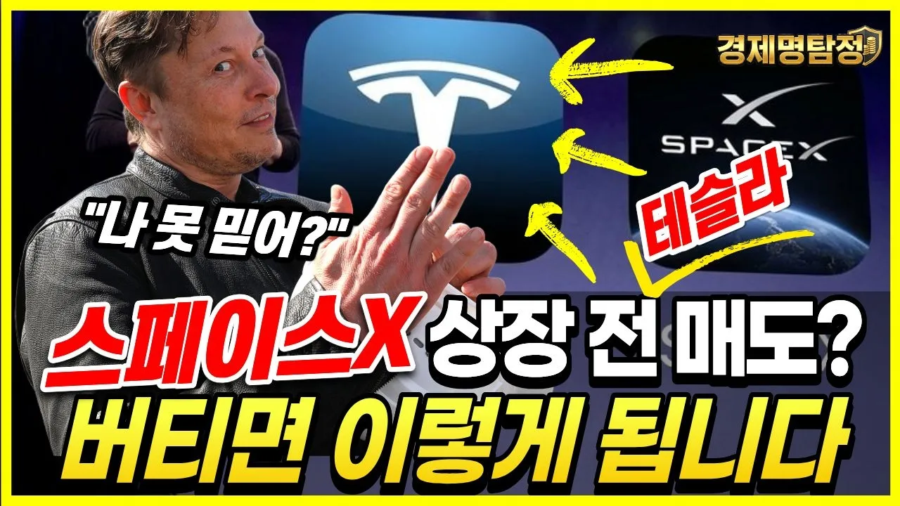

# 스페이스X 상장 전 테슬라 주식 팔아야 할까? 버티면 이렇게 됩니다

## 기본 정보
- **URL**: https://www.youtube.com/watch?v=CeknuZxbxF8
- **채널명**: 경제명탐정
- **구독자수**: 9만
- **조회수**: 169,750
- **업로드일**: 2026-04-03
- **영상 길이**: 18:31
- **댓글 수**: 256
- **좋아요 수**: 4,785

## 썸네일

---

## 댓글 (추천순 TOP 10)

| 순위 | 좋아요 | 댓글 |
|------|--------|------|
| 1 | 6 | 현재 미국 SpaceX 직원으로 Starlink 인공위성을 만드는데 제가 다니는 회사와 하는일이 나오니 자랑스럽군요 |
| 2 | 38 | 걍 나스닥 꾸준히 모아가는게… |
| 3 | 13 | 내용 깊이보소 ㅋㅋ 따봉 |
| 4 | 9 | 버틸려고 합니다~ 그전에 꼭 사고샆네요 |
| 5 | 14 | 베~리 나이스^^ |
| 6 | 16 | 알게 되서 지식 힘이 생김 ❤❤❤ 돈의 구조를 조금씩 알게 되네요 . 감사 ❤❤❤ |
| 7 | 11 | 굿🎉❤ |
| 8 | 5 | 정리 무지 잘하신 듯 합니다! ❤ |
| 9 | 6 | 감사합니다 좋은정보 항상 공유 해주셔서 많은 도움이 됩니다 ^^ |
| 10 | 4 | 내용 좋아요 감사합니다 |
