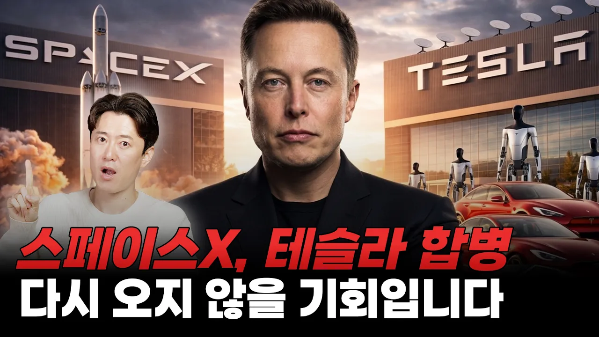

# 스페이스X, 테슬라 합병... 다시 오지 않을 기회입니다!

## 기본 정보
- **URL**: https://www.youtube.com/watch?v=JwobfbyCsnU
- **채널명**: 재테크읽어주는 파일럿
- **구독자수**: 127만
- **조회수**: 372,805
- **업로드일**: 2026-04-06
- **영상 길이**: 11:04
- **댓글 수**: 515
- **좋아요 수**: 11,333

## 썸네일

---

## 댓글 (추천순 TOP 10)

| 순위 | 좋아요 | 댓글 |
|------|--------|------|
| 1 | 390 | 국내기업들은 쪼개기 바쁜데 역시 미국은 합병이 당연하구나 주주보호에 최선을 다하는 진정한 주식회사 |
| 2 | 9 | 미국은 한국보다 상속증여세가 월등히 낮은데 그마저도 산탁을 통해 한푼도 안낼 수 있는 방법이 있으니깐 그렇지. |
| 3 | 4 | 상속세때문에 쪼갤수 밖에 없음 |
| 4 | 1 | 테슬라 주가만 지하로 파고 드네 염병 |
| 5 | 16 | 합병하는 이유는 주주를 위해서가 아니라 테슬라에대한 머스크의 지배권을 강화하기 위해서임. |
| 6 | 0 | 우리나라는 대기업이 되면 경영자 입장에서는 좋을게 없습니다. 제도를 손봐야지요 |
| 7 | 5 | 팩트만 말해드림  미국이라서 X 일론이라서 O |
| 8 | 1 | 합병을 한다고 누가 그랬죠? 이건 법적으로 불가능입니다. 완전히 다른 회사 입니다. |
| 9 | 0 |  @Remyremy-b6u  합병이 왜 법적으로 불가한가요???불법이 아닐텐데요??? |
| 10 | 3 | ​ @tastetale 불법은 아니죠. 주인이 같다고, 주인 마음대로 회사를 합병 못하죠. 한 회사의 자회사면 가능합니다. 좀 알아보세요. |
