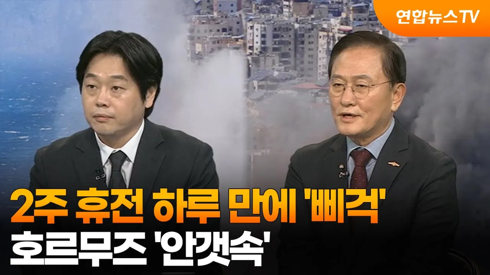

# [뉴스특보] 2주 휴전 하루 만에 '삐걱'…호르무즈 '안갯속' / 연합뉴스TV (YonhapnewsTV)

## 기본 정보
- **URL**: https://www.youtube.com/watch?v=C5Ohf6lwkLY
- **채널명**: 연합뉴스TV
- **구독자수**: 222만
- **조회수**: 13,293
- **업로드일**: 2026-04-09
- **영상 길이**: 33:55
- **댓글 수**: 18
- **좋아요 수**: 95

## 썸네일

---

## 댓글 (추천순 TOP 10)

| 순위 | 좋아요 | 댓글 |
|------|--------|------|
| 1 | 1 | 이번전쟁으로. 경제는. 돌수도. 하지만. 당한애들.  피해는. 죽었다는거 |
| 2 | 2 | ㅎㅎㅎ. 통행료 미국이 같이 받는다,정말 사업가같은 단순한 생각이다 |
| 3 | 1 | 휴전이한국에 유리할지댸응해야한다 |
| 4 | 0 | 냉전시대로. 가는건. 방산만.  배부르지 |
| 5 | 0 | 주한미군은. 은혜는. 아는데. 미국실업자구제거든 |
| 6 | 0 | 우리나라같으면.  너죽고나죽자로. |
| 7 | 0 | 그런. 삼각함수는. 고딩수준이면.  알지요. 중국 러시아 견제성이고.  에너지전쟁.  이스라엘은.  보복전쟁과. 방어전쟁. 과시용전쟁이고.  만의하나. 중국이. 나서면. 끝 |
| 8 | 1 | 전문가들  이스라엘  포탄이'없다던니 하나님께서 내려주셨'나 |
| 9 | 0 | 우리가돈주고 |
| 10 | 5 | 호르므즈 통행료 받으면 `새로운 해적` 맞아요  두나라 싸움에 세계 다른나라가 파해보면안되죠 |
