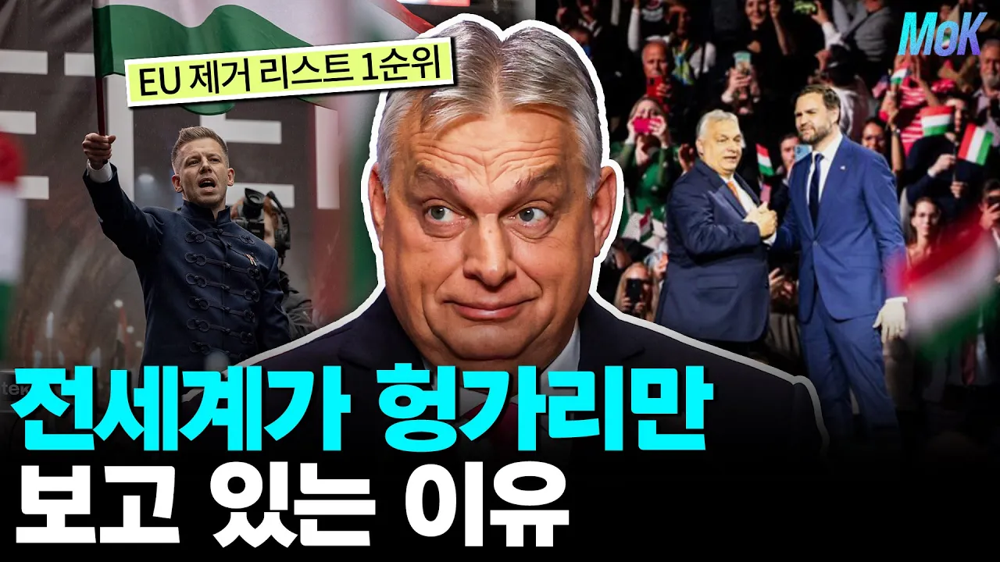

# 전세계가 헝가리의 오르반만 보는 이유

## 기본 정보
- **URL**: https://www.youtube.com/watch?v=p5dDZ8WF5EA
- **채널명**: capitalism school
- **구독자수**: 8만
- **조회수**: 87,958
- **업로드일**: 2026-04-10
- **영상 길이**: 8:31
- **댓글 수**: 480
- **좋아요 수**: 1,560

## 썸네일

---

## 댓글 (추천순 TOP 10)

| 순위 | 좋아요 | 댓글 |
|------|--------|------|
| 1 | 324 | 절대 권력은 절대 부패한다 |
| 2 | 8 | 싱가폴 리콴유보면 유능한 독재자가 더 나을수도있음 다만. 유능해야함 |
| 3 | 7 | ​ @김재승이 그게 반드시 보장이 안되니 문제이지요. 자유 민주주의를 옹호하는 건 차악이기때문이지. 최선이기 때문이 아닙니다.  공화 민주국가의 최저점과 왕정 독재정의 최저점은 완전히 다르죠. 우리는 시리아 내전만 봐도 독재정 혼란의 최저점을 볼수 있죠 |
| 4 | 0 |  @김재승이  리콴유도 리콴유가 살아있을 때는 괜찮을 수 있지만 사후에는 또 얘기가 다를 수 있지. 하지만 민주정도 한계가 있어서 대세를 뒤바꿀 정도의 변화가 필요한 상황에서는 독재체제가 유리한 부분도 있는건 사실 |
| 5 | 4 | 서유럽 나라들 꼬라지 보면 차라리 저런 절대권력이 나아보이는데 |
| 6 | 1 | 절대 권력이 왜 나쁨? 우리나라 같은 나라는 그런 사람이 해야함 |
| 7 | 20 | ​@Villar0910이재명 절대 권력 찬성하심? |
| 8 | 4 | ​ @user-nasanato  이재명은 한국 민주주의 썩어빠진 중우정치의 결과인데? 좌파들 득실거리는 한국에서 아직도 자유민주주의 어쩌고 하는 가짜 우파가 이상한거지 ㅋㅋ 푸틴이나 히틀러 같은 지도자가 참된 지도자지 |
| 9 | 10 | ​@Villar0910중우정치는 무슨 ㅋㅋㅋㅋ 저번 지선에서 국힘이 압승한것도 그렇고, 생각보다 국민들이 멍청하지는 않음. 그런데 보수에서 계속 오른쪽으로 악셀을 밟으면 중도가 좋아하겠노? 애초에 극우 팽하고 홍준표 밀어줬으면 이번 대선도 혹시 몰랐음. |
| 10 | 3 | ​@Villar0910흠....왜본인은 다르다고 생각하는지? |
