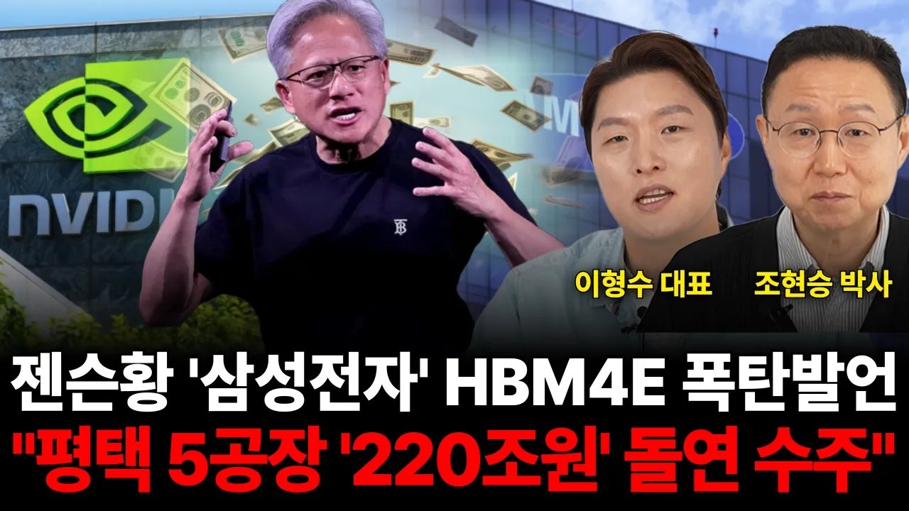

# 젠슨황 '삼성전자' HBM4E 폭탄발언, "평택 5공장 '220조원' 돌연수주'" (이형수 대표, 조현승 박사 / 반도체특집)

## 기본 정보
- **URL**: https://www.youtube.com/watch?v=Uac_39xNwCc
- **채널명**: 웅달 책방
- **구독자수**: 96만
- **조회수**: 24,024
- **업로드일**: 2026-04-20
- **영상 길이**: 26:40
- **댓글 수**: 97
- **좋아요 수**: 849

## 썸네일

---

## 댓글 (추천순 TOP 10)

| 순위 | 좋아요 | 댓글 |
|------|--------|------|
| 1 | 18 | 삼성은 대한민국의 국민기업입니다 무조건 잘 되어야합니다 |
| 2 | 14 | 삼성이 잘 되어야 나라가 산다. |
| 3 | 28 | 삼성 국가의 미래입니다. 뭐든 잘되길 기원합니다. 오늘 내용 참 좋아요 |
| 4 | 1 | 삼성이여. 영원하라 대한민국의 희망 미래 🎉🎉🎉 |
| 5 | 0 | 근데 이재용이 재무통만 우대해서 파운드리 폭삭 망해 점유율 7% |
| 6 | 0 | 메모리도 sk하이닉스에 뒤져 범용메모리 감산하는 바람에 중국이 무섭게 점유율 늘려가고 이재용을 퇴진 시켜야해 재무통 사퇴시켜야  늦게나마 반도체 출신 수장을 공동 부회장으로 임명해서 다행 |
| 7 | 13 | 엔비디아가 차기 그록칩을 tsmc에 맡겨 기존칩과 효율성을 높이려 할거라는 분이 있던대 ㅜㅜ 삼성이 계속  잘 뽑아 파운드리 부흥되길 바랍니다 |
| 8 | 5 | 이형수대표님 항상 응원합니다 🎉🎉🎉 |
| 9 | 8 | 삼성 최고네요!!! |
| 10 | 9 | 삼성전자 텐배거 가자 홧팅!!! |
