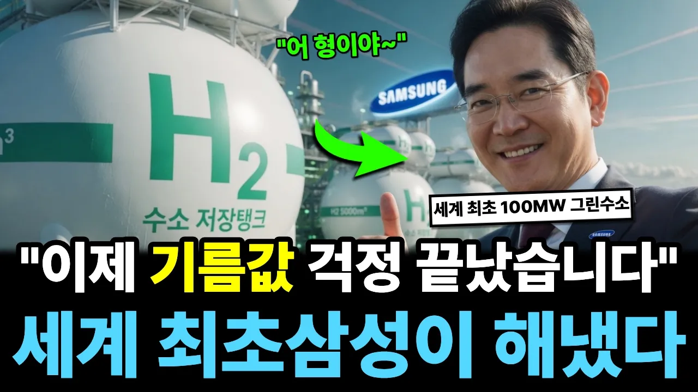

# "이제 기름값 걱정 끝났습니다" 중동이 한국에 매달리는 시대, 삼성이 끝내 해낸 '이 기술'

## 기본 정보
- **URL**: https://www.youtube.com/watch?v=0_rkNaOFOYs
- **채널명**: 나라 돌아가는 이야기
- **구독자수**: 9,460
- **조회수**: 370,297
- **업로드일**: 2026-04-21
- **영상 길이**: 33:32
- **댓글 수**: 909
- **좋아요 수**: 18,512

## 썸네일

---

## 댓글 (추천순 TOP 10)

| 순위 | 좋아요 | 댓글 |
|------|--------|------|
| 1 | 366 | 70~80년대 중동 건설 현장에서 땀 흘리셨던 분들, 오일쇼크 때 주유소 줄 서고 기름 배급표 받아보셨던 분들, 그때 이야기를 댓글로 들려주시면 제가 고정으로 올려서 많은 분들과 나누겠습니다. 여러분의 피땀이 오늘 이 수소 시대의 밑거름이 됐다는 사실, 절대 잊지 않겠습니다. |
| 2 | 56 | 저희  아버지는  평생을  열사의  나라  사우디에서  몸받쳐 일하셨다 ~ 지금도  그때를  생각하면  ~ 가슴이  저려온다  ㅡ 우리가 보낸  녹음테프를  들으시면서  견뎌내셨다  하셨다  ~ 인생의마지막도  생활고와  자식에게 부담주기 싫다면  스스로  삶을  마감하셨다  ~  나의  가슴에  대  못을 박고  가셨다  ~ 자식이  죽으면  가슴에  묻는다했다 ~  난  내 아버지를  가슴에  묻고  살고있다  ㅡ 양가  부모님은  나라 사랑에  끔찍하셨다 ㅡ IMF  때는   집안에  금 덩어리는  다  나라에 받쳐  ~ 우리집은  금  한돈이  없다~ |
| 3 | 6 | ​ @희망-c3p   아  ~  그러시군요  그런데  아침에  님의글읽다가  눈물이  펑펑  쏱아지네요  나도  그시절을  살아온사람임  이렇게  선조들의   수고로  이뤄놓은나라가  침몰하고있으니   통탄할일이네요  요즘  잠도  제대로  못잡니다  😭 |
| 4 | 5 | ​ @희망-c3p 저도 그래요. 아이들 돌반지도. 한개 없어요 |
| 5 | 4 | ​ @희망-c3p 군 제대후 77년 사우디행 비행기를타고 84년말 귀국하니 다음날이 85년 새해가 밝았읍니다 숨이 턱턱 막히는 더위와 풍토병에 시달리는 환경속에서 땀을 쥐어짜면 소금이 옷에 베어나온다 그래도 미래의 희망을 갖고 행복한 시간이었기에 ~ 하지만 나에게는 돈이 한푼도 주어지지않은 모친과 형의 악랄한 행위로 좌절의시간 그리고 그것은 나의 일생을 고통과 파탄을 |
| 6 | 3 | ​@Hskim12 고생많이 하셨는데, 남은세월 자신만을 생각하며 건강 잘 지키시고 행복하게 사세요~😢 |
| 7 | 34 | 이재용  회장 님 주님의 은혜 로 축복하고 🎂 드립니다 주님  께서  우리의  위대하신 이재용 회장님 과 삼성  그룹의  모든분들 천하보다 귀하게 💕 사랑 💕 하심니다  할렐루야 |
| 8 | 33 | 삼성만세!. 이재용회장님 만세!. 감사합니다. 그대는 대한민국의 영웅이십니다 !. |
| 9 | 16 | 현대 수소차 타는 사람이 충전소가 몇개 없어서 힘든다는 얘긴 들었지요   많이 활성화 된담에 이소식을 듣는다면 의심이 없겠지만.  오만 관련 사업얘기도  첨듣는 소식이라 반갑기는 한데  실현 가능성이 얼마나 있는지는 조금 지켜봐야 겠네요 |
| 10 | 11 | 대환민국.... 주님의 이름으로 축복드림니다🎉🎉🎉❤❤ |
