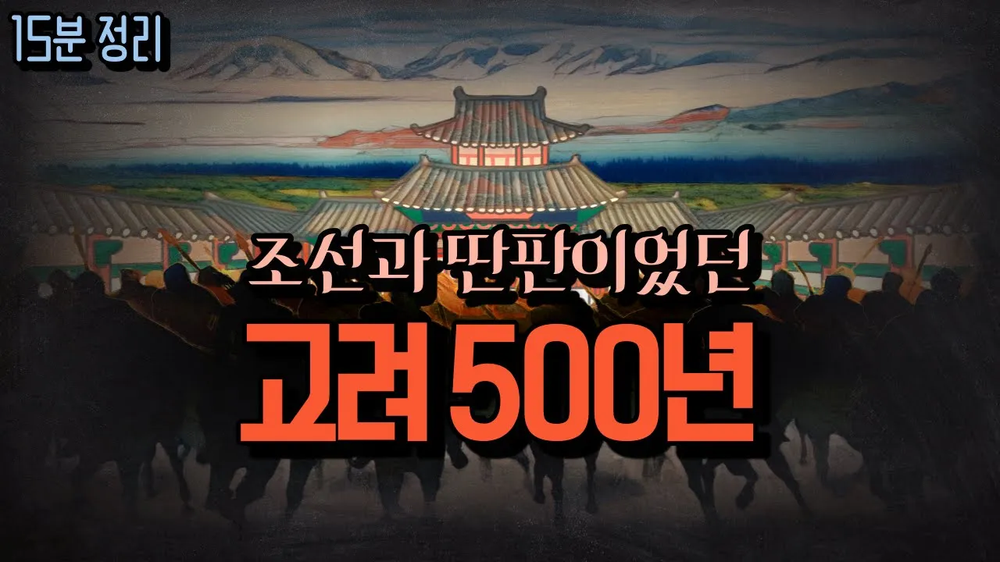

# 15분간 옛이야기 듣듯 정리하는 '고려 역사 500년'

## 기본 정보
- **URL**: https://www.youtube.com/watch?v=jAHzsfTXLko
- **채널명**: Ssom Writer's Knowledge Dictionary
- **구독자수**: 60만
- **조회수**: 4,651,339
- **업로드일**: 2022-05-31
- **영상 길이**: 16:57
- **댓글 수**: 3,200
- **좋아요 수**: 35,195

## 썸네일

---

## 댓글 (추천순 TOP 10)

| 순위 | 좋아요 | 댓글 |
|------|--------|------|
| 1 | 14 | 정말 특이하긴 하다 전세계 사람들이 조선이 아닌 아직도 고려라고 부르는것이   확실히 조선 500년 이씨 왕조시대는 유교 선비사상 쇄국정책으로 무역이든 문화든 쇠퇴하던 시기가 맞는거 같다 |
| 2 | 3,500 | 광종이 다 교통정리 해두고 뒤에 성군이 나오는건 역사의 진리인듯. 항상 불도저 군주가 나온 다음엔 그 자식들 중에 똑똑한 애들이 국가를 발전으로 이끌더라. 소수림왕-광개토대왕-장수왕, 광종-성종, 태종-세종 |
| 3 | 420 | ㄹㅇ 나라의 틀을 잡은 후엔 성군이 많이 나오는 듯 백제 고이왕 근초고왕, 신라 법흥왕 진흥왕, 고려 광종 성종, 조선 태종 세종 세조 성종, 고구려 소수림왕 광개토대왕, 발해 문왕 선왕 |
| 4 | 7 |  @khkhlee404 세조요? |
| 5 | 1 |  @khkhlee404  +영조 정조는 안들어가나요? |
| 6 | 1 | ​ @khkhlee404 숙종-영조-정조도요. 숙종때 환국으로 신하들 잘밟아놔서 영정조때 어느정도 왕이 편하게통치할수있던거같음 |
| 7 | 0 |  @khkhlee404  나라의 틀을 잡을만큼의 어진자라면 아들도 어질기 마련이죠 |
| 8 | 7 |  @khkhlee404  세조가 성군이라니..... |
| 9 | 10 | 고려는 성종보단 현종이지 |
| 10 | 7 | 왜들 관심병환자에게 밥들주고 계십니까 여기 |
