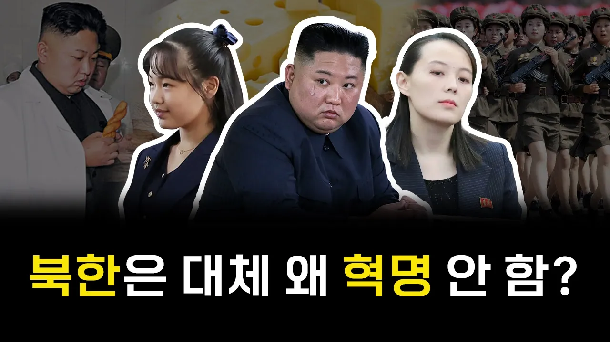

# 김씨 정권 붕괴는 언제쯤 될까?

## 기본 정보
- **URL**: https://www.youtube.com/watch?v=NIWTQdvAJgU
- **채널명**: 지식한입
- **구독자수**: 147만
- **조회수**: 1,082,506
- **업로드일**: 2025-09-13
- **영상 길이**: 10:01
- **댓글 수**: 2,100
- **좋아요 수**: 8,888

## 썸네일

---

## 댓글 (추천순 TOP 10)

| 순위 | 좋아요 | 댓글 |
|------|--------|------|
| 1 | 4,500 | 북한 우리가 흡수 못하면 서울 코앞에 중국 국경선이 들어설거임 선택의 여지가 없음 파주 너머가 중국이면 감당이 될거같음? |
| 2 | 8 | 중국이나 러시아나 다 통일은 싫어함 북한 주도 통일은 불가능하고 결국 통일은 한국주도의 통일일 수 밖에 없고 그럼 북한 지역까지 친미 국가가 들어서는건데 중국 러시아가 친미구각와 국경을 맞닿는걸 원하지 않음 그래서 북한이라는 완충지역이 필요한거야 친미정권이 아닌 친중정권을 만들려고 하는거고 미국과 우리는 북한을 정상적인 나라로 친미, 친한 정권을 세우고 싶은거고 통일이야 먼나라 얘기인거고 |
| 3 | 3 | 강 끼고 북한지역에서 막냐 수도권 한강라인에서 막냐가 얼마나 큰데... |
| 4 | 0 | @k @kih7기-h9h 에 북한을 러시아나 중국이나 우크라이나처럼 그들 수중에 넣길 바라고 있어. 공식적으로는 안먹을거란 말이지. 러시아가 먹어도 중국에서 반발할꺼고 중국에서 먹어도 러시아가 반발 및 견제할꺼야. 유사시 극동의 부동항에 해당하는 지역이기도해서. 단순히 미국한테만 넘어가길 바라지 않는 건 아니야. 북한땅의 이런 특수성때문에 어느 나라 특정 영토에 완전히 편입되기는 힘들어. 그래서 그들이 어떻게든 북한을 울며겨자먹기로 도와준게 있어. 물론 유사시에는 중국이 들어오겠다 하지만 러시아가 가만히 있을지는 두고봐야할 문제야. 게다가 한국도 가만히 있진 않을텐데 까딱하면 3차세계 대전격으로 번질수 있어. |
| 5 | 2 | 신라가 천년을 간 이유..수도가 국경과 너무 멀었음 |
| 6 | 1 | 흡수 해도 압록강 너머로 중국 국경 아님? |
| 7 | 1 | 쿠데타일어나면 중국이 먼저개입할듯 우리나라는 7군단이 북진하고 |
| 8 | 0 | 중국이 먹으면 체하지 역사가 말해줌. 중국이 다 나눠질 것을 |
| 9 | 0 | 어차피 나눠먹는건 확정임 단일로 누가 2천만 난민을 어떻게 소화해 |
| 10 | 0 | 중국이 안먹을거라고 하는 사람들 있나 본데 2022 이전의 러시아가 대표적임 그때도 러시아가 크림반도 합병과 돈바스 지역만 괴뢰화 시켰지 우크라이나 침공은 하지 않을거라던 전문가들이 다수였음, 제 아무리 중국이 북한 합병하지 않을거라고 말한들 그것은 예측을 할수 없음, 그것에 대비를 해야할것일뿐,, |
