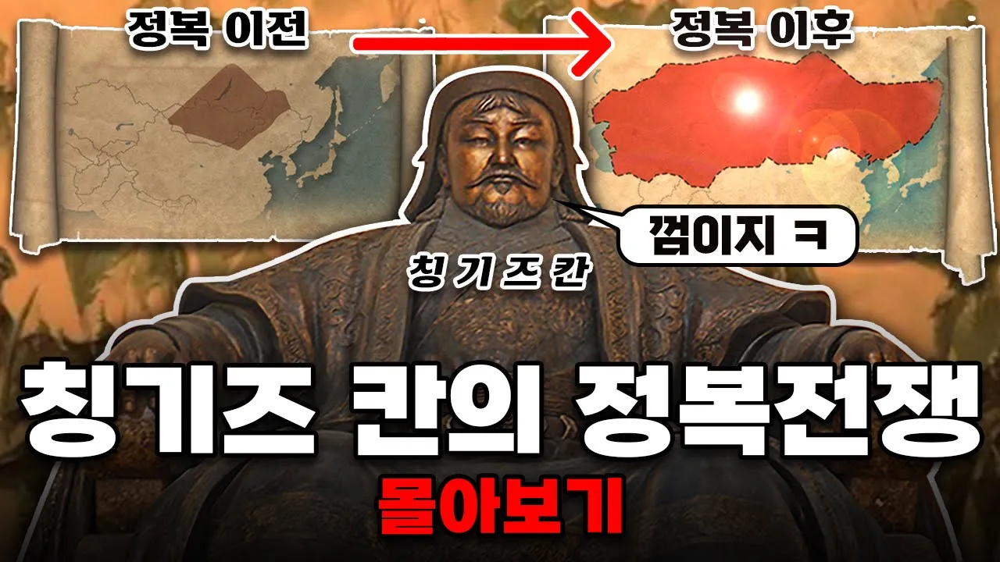

# 역사 이래 최강의 정복자, "칭기즈 칸"의 정복전쟁 몰아보기

## 기본 정보
- **URL**: https://www.youtube.com/watch?v=qklCjjUyWuY
- **채널명**: 별별역사
- **구독자수**: 79만
- **조회수**: 2,072,916
- **업로드일**: 2023-02-22
- **영상 길이**: 44:36
- **댓글 수**: 728
- **좋아요 수**: 11,481

## 썸네일

---

## 댓글 (추천순 TOP 10)

| 순위 | 좋아요 | 댓글 |
|------|--------|------|
| 1 | 158 | 봉닭 작가님의 [좌충우돌 몽골제국사] 웹툰 보기 링크!
 https://www.emanbae.com/series/1080
 
 지식웹툰 플랫폼 "이만배"에 연재! 당시 몽골제국의 역사, 그리고 다양한 면모를 동글동글 힙한 그림체로 알려주면서, 실제 몽골제국의 일상, 당시의 최첨단무기인 화약, 의학기술, 몽골인이 읽었던 책들까지! 몽골제국의 A to Z를 모조리 섭렵하실 수 있는 웹툰입니다.
 사실 몽골제국 얘네가 전쟁만 잘한 게 아니고 다른 것들도 볼거리가 많더라구요! 그러니 몽골제국에 대해 몰랐던 새로운 맛을 느끼고 싶으신 분들께 추천드립니다! |
| 2 | 7 | 이번 웹툰 재밌게 잘보겠습니다~ |
| 3 | 5 | 뜬금없지만 나중에 여유되면 키프로스랑 터키 관련된 내용도 설명해 주시면 안될까요? |
| 4 | 4 |  @DongtanVolka  오 그것도 재밌겠다! |
| 5 | 4 | 님.쿠빌라이가동명이인인가여? 난징기스칸장수중에.쿠빌라이란장수를들어본적이없는데...혹시손자아닌가여?> ㅋㅋㅋㅋ |
| 6 | 3 | 은글 슬쩍 최대영토에서 고려 빼놓는거 보소 ㅋㅋㅋㅋ |
| 7 | 3 | 한국도 정벌하여 복속시켰는데 왜 지도에 몽골색이 아니고 하얀색으로 만든거죠? 그당시 왕들이 본래 이름을 갖지않고 충씨로 시작하는 등 귤욕스러운일도 있었고 정동행성을 설치하여 감시도 했는데 왜 한국을 독립국가처럼 묘사한건가요? 챙피하다고 가리면 그역사가 없어집니까? 생각좀 하고 영상만듭시다ㅉㅉ 당신같은 사람들이 중국의 동북공정, 일본 임나일본 주장하는 사람들과 뭐가 다릅니까?ㅉㅉ |
| 8 | 0 | ​ @neogeo1826 매국노?우리멸망은안함 |
| 9 | 1 | 1906년 → 1966년 → 2026년 60년 주기로 보면 동북아가 크게 흔들리는 패턴이 진짜 있는 것 같아요. 1906년 러일전쟁, 1966년 문화대혁명... 몽골 고문서에도 이런 주기적 변화 기록이 남아있다는데 역사를 알면 미래도 보이는 것 같습니다. |
| 10 | 0 | 1906년 → 1966년 → 2026년 60년 주기로 보면 동북아가 크게 흔들리는 패턴이 진짜 있는 것 같아요. 1906년 러일전쟁, 1966년 문화대혁명... 몽골 고문서에도 이런 주기적 변화 기록이 남아있다는데 역사를 알면 미래도 보이는 것 같습니다. |
