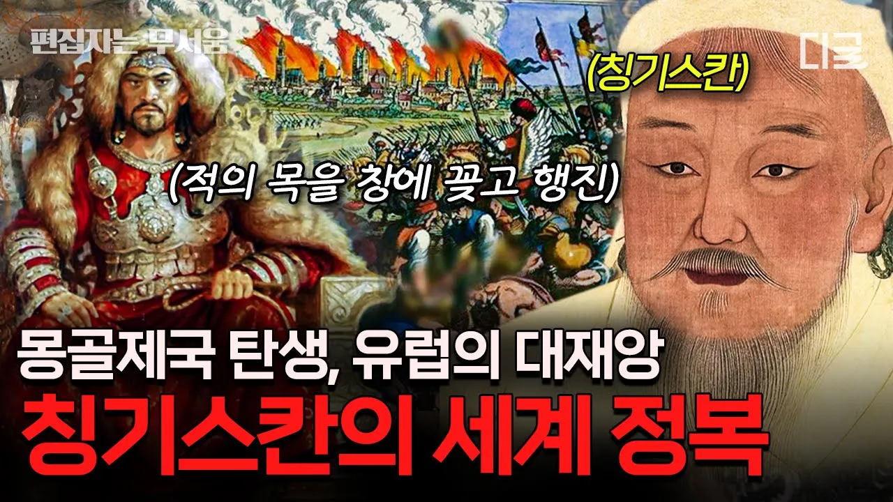

# [#벌거벗은세계사] (90분) '복수는 나의 것!' 역사상 가장 큰 영토를 가졌던 정복왕 칭기스칸과 몽골제국의 탄생⚔

## 기본 정보
- **URL**: https://www.youtube.com/watch?v=jN66qHCw6Ms
- **채널명**: 디글 :Diggle
- **구독자수**: 425만
- **조회수**: 3,504,900
- **업로드일**: 2023-03-02
- **영상 길이**: 1:33:38
- **댓글 수**: 1,200
- **좋아요 수**: 16,001

## 썸네일

---

## 댓글 (추천순 TOP 10)

| 순위 | 좋아요 | 댓글 |
|------|--------|------|
| 1 | 228 | 피지컬 아시아 보고 몽골팀에 반해 몽골 역사 영상까지 보러 옴🥹 |
| 2 | 12 | 몽골인으로서 너무 감동이에요🥺 |
| 3 | 7 | 저도요!! 갑자기 궁금해서 왔어요!! |
| 4 | 4 | ㅎㅎ 칸은 간판일뿐 4마리의 개까지가서  수부타이 추격전까지가면 감탄이 |
| 5 | 2 | 멀리도 오셨습니다 |
| 6 | 0 | 학살과 약탈의 역사 뭐든 결과만보면 멋져보이지 |
| 7 | 80 | 인류사 최강의 알파메일 |
| 8 | 251 | 저는 몽골 사람입니다. 그리고 저는 슈퍼주니어 팬이기도 하고 엘프이기도 합니다. 그래서 규현이가 몽골 이야기를 하는 게 정말 기뻐요. 언젠가는 너가 우리나라에 오기를 바랍니다. 비와 산다라박이 최근 우리나라에 공연을 하러 왔습니다. 그렇기 때문에 몽골 팬들은 언젠가 너가 오기를 기다리고 있습니다.❤ |
| 9 | 12 | 헐 저도 몽골 사람이에요 |
| 10 | 12 | 너가 오기를 기다리고 있다고 하니 안 가면 죽을 것 같음 ㅋㅋㅋ |
