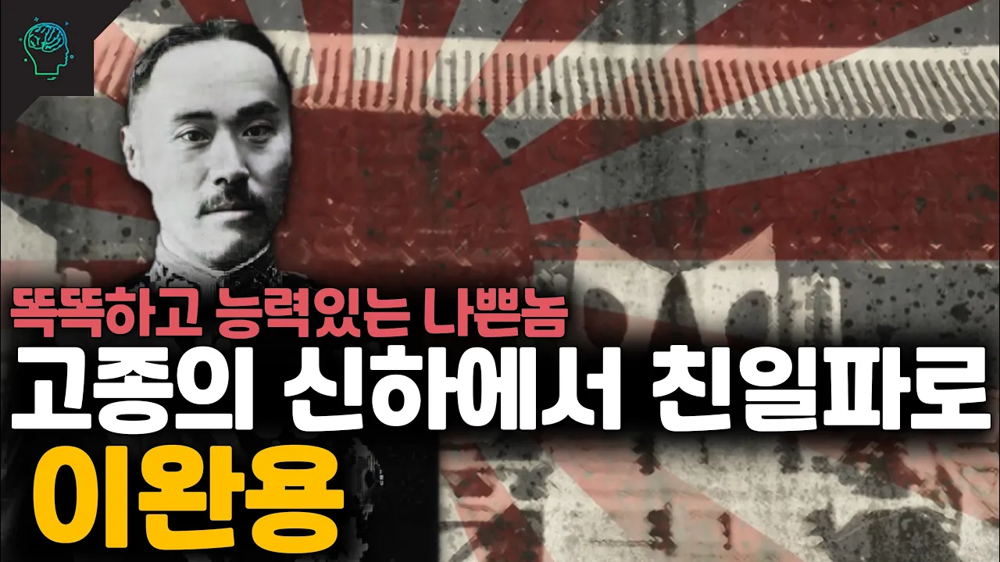

# 이완용의 인생/생애 (+유언)

## 기본 정보
- **URL**: https://www.youtube.com/watch?v=B456BLwvzZg
- **채널명**: 당신이 몰랐던 이야기
- **구독자수**: 130만
- **조회수**: 132,853
- **업로드일**: 2022-01-27
- **영상 길이**: 11:42
- **댓글 수**: 1,000
- **좋아요 수**: 2,057

## 썸네일

---

## 댓글 (추천순 TOP 10)

| 순위 | 좋아요 | 댓글 |
|------|--------|------|
| 1 | 19 | 랭킹 스토리 채널 : https://bit.ly/3qzfP4B
 
 유돈노 스토리 채널 : https://bit.ly/3DIeprz
 
 당몰이 스포츠 채널 : https://bit.ly/3FxfGTF
 
 (당몰이 전역까지 217일) |
| 2 | 1 | . |
| 3 | 1 | 4:38 그 당시 독립협회와 독립문은 일제가 아닌 청나라에 대한 독립인데요. 그래서 국가명도 대한제국으로 바꾼것이고요. |
| 4 | 0 | . |
| 5 | 179 | 유능한것도 맞지만 나라 하나가 한사람한테 팔려나가는것 보면 조선말기가 진짜 답이 없었다는거지... |
| 6 | 44 | 나라를 판건 고종.... |
| 7 | 8 | 고종이 팔았는데.. |
| 8 | 40 | 그냥 고종이 하라고 한거야 |
| 9 | 2 |  @lIoveo0v  ㅇㅈ 실제로 고종왕실은 나라 망하고 이왕직으로 이완용보다 훨 좋은 대우 받고 살았음 |
| 10 | 2 | 애초에 한 사람의 결정에 한순간에 띡 팔려나간 게 아님 |
