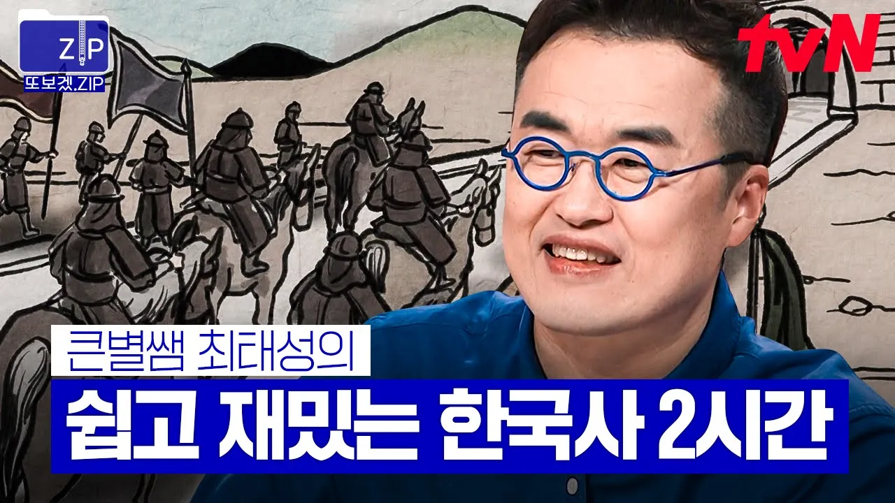

# (140분) 조선 최고의 명장 이순신부터 매국노의 대명사 이완용까지! '큰★별쌤' 최태성이 알려주는 한국사 2시간📚 | 프리한닥터W

## 기본 정보
- **URL**: https://www.youtube.com/watch?v=J_QYzXuOP9E
- **채널명**: tvN Joy
- **구독자수**: 451만
- **조회수**: 537,802
- **업로드일**: 2024-08-18
- **영상 길이**: 2:14:47
- **댓글 수**: 88
- **좋아요 수**: 3,109

## 썸네일

---

## 댓글 (추천순 TOP 10)

| 순위 | 좋아요 | 댓글 |
|------|--------|------|
| 1 | 47 | 저는 우울할때마다 최태성 선생님 한국사 강의 들어요 |
| 2 | 9 | 알기 쉽고 재밌게 이야기를 해주시네요~~~ |
| 3 | 28 | 이렇게 매력적인 영상을 본 적이 없어요! 설득력 있는 내용, 생생한 전달, 정말 훌륭합니다. 다음 영상도 기대되네요! |
| 4 | 2 | ㄱ |
| 5 | 0 | 최태성님 한국사이야기 재밌어서 종종 들어요~😊 |
| 6 | 20 | 큰별쌤 최고최고 입니다 👍 ❤ |
| 7 | 2 | 역사가 이렇게 재미있네요 |
| 8 | 1 | 오상진 똑똑하네요 |
| 9 | 87 | 역시 역사를배워야한다 |
| 10 | 0 | 최고 👍 |
