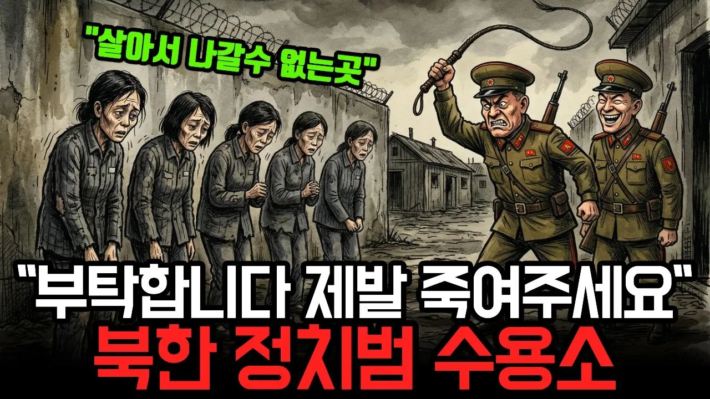

# "서울만한 크기의 거대 감옥이 지금 한반도에 있다? 68년간 단 한 명도 못 빠져나온 '완전통제구역'의 비밀"

## 기본 정보
- **URL**: https://www.youtube.com/watch?v=5NoY958pHHs
- **채널명**: 역썰남(역사 썰풀어주는 남자)
- **구독자수**: 9,940
- **조회수**: 97,460
- **업로드일**: 2026-04-13
- **영상 길이**: 17:40
- **댓글 수**: 382
- **좋아요 수**: 1,412

## 썸네일

---

## 댓글 (추천순 TOP 10)

| 순위 | 좋아요 | 댓글 |
|------|--------|------|
| 1 | 145 | 이런걸 초등학교에서 교육용으로 가르쳐야합니다. 현시점이 어떤것인지.. 얼마나 나라에 감사해야하는지.. 자유가 왜 중요한지.. |
| 2 | 9 | 187석 덕분에 불가능할듯요 ㅠㅠ |
| 3 | 3 | 초등교사입니다.. 정말 보여주고 싶네요 ㅋㅋㅋ 후 |
| 4 | 1 | 인정 |
| 5 | 1 | 이미우린 늦엇습니다 각자도생해아합니다.. |
| 6 | 0 | 겠냐 |
| 7 | 85 | 한국전 6.25국가유공자분들 안계셨으면 늘 감사하면서 살자 |
| 8 | 66 | 같은 민족에게 저렇게 한다는 것이 민족의 슬픔이다 |
| 9 | 120 | 자유가얼마나좋은지 다들정신들차려야한다. |
| 10 | 202 | 김일성이 북한을 지옥으로 만들었다 |
